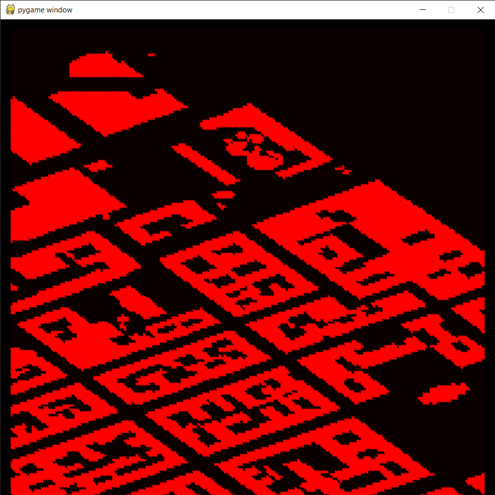
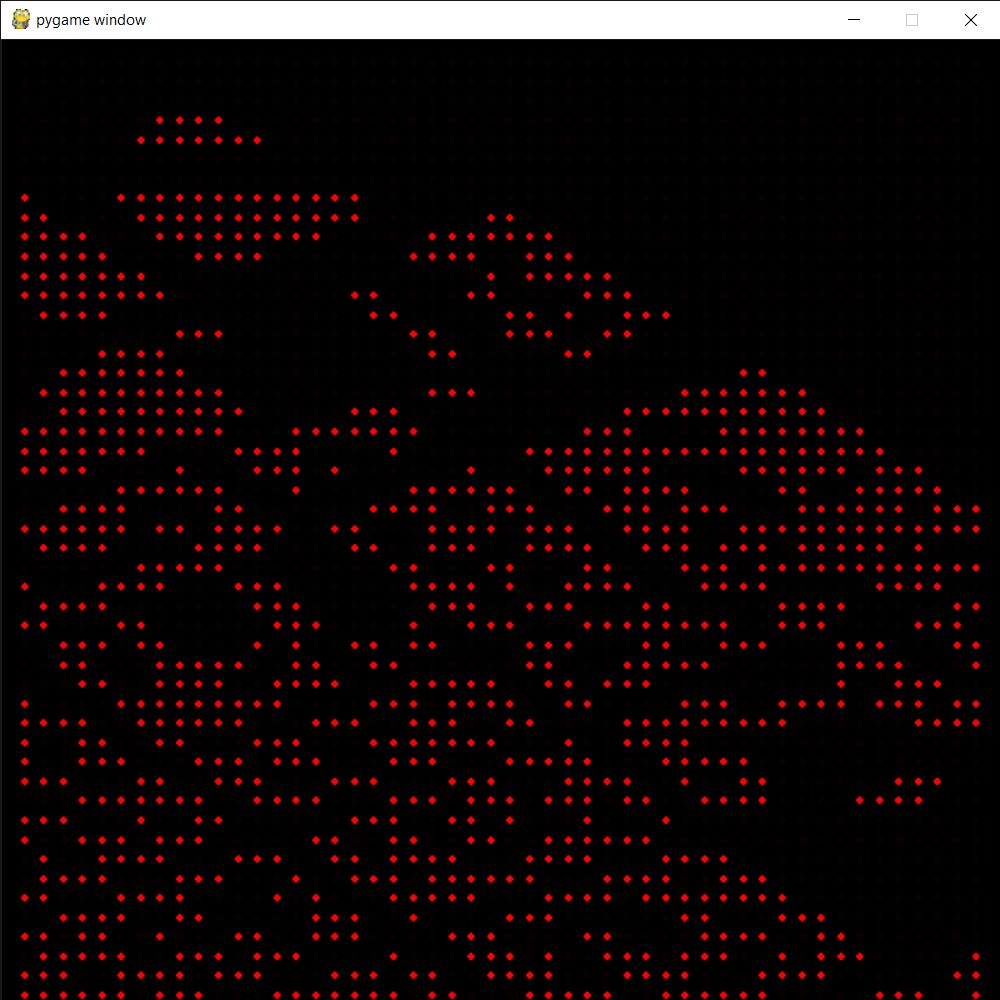
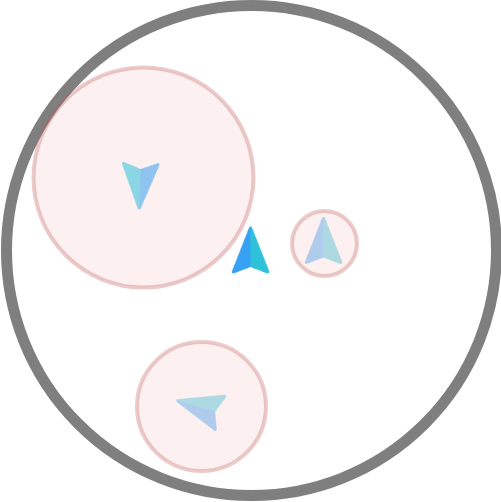
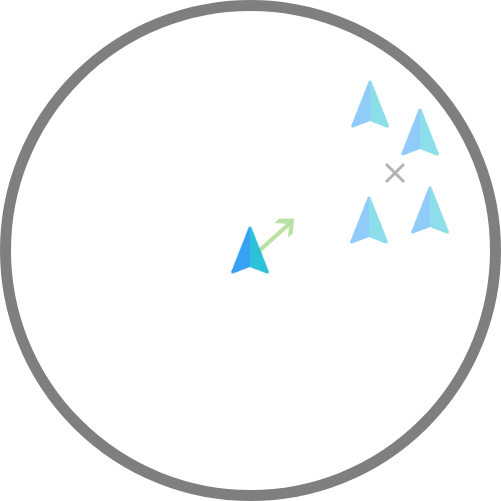
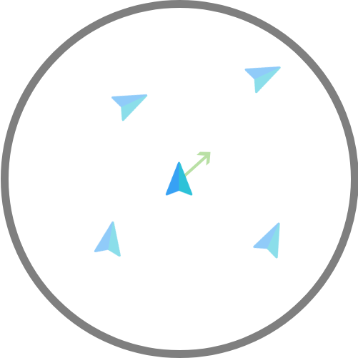

# Motivation

With the world moving faster every day, the demand for services grows rapidly. In recent years we have
seen a significant rise of interest in drone technology, as a means to allow our society to satisfy this demand.
Drones will soon start to play a major role in our lives and they will change the urban landscape of cities as
we know them.
Drones, also know as unmanned aerial vehicles (UAVs), have been given a lot of attention for military
use. However, the popularity of using drones for commercial purposes is rising every day. Remarkable
advancements have been made in the area of drone-assisted parcel delivery as well as drone-assisted medical delivery, however, the potential of food delivery using drones has not been investigated thoroughly
as of now.
There is a number of potential benefits that could arise from the use of drones for food delivery. These
could include the decrease and avoidance of traffic congestion, the possible decrease in labour costs
and, last but not least, increased delivery speed.
The aim of this paper is to present a feasible model for drone-assisted food delivery in urban areas and
come up with a number of research questions to answer to allow for implementation of such a concept. In
section 2, a brief overview of the concept is given. The three following sections, section 3, section 4 and
section 5 give a more in-depth insight into different stages of the operation.

# Urban airspace model
In an urban environment, pathfinding (or routing) is a crucial task for delivery. Any drone has to be able to
avoid known static and dynamic obstacles as well as unknown obstacles. Furthermore, not all areas
are accessible by the drone. The existence of geofenced areas, no-fly zones, known obstacles such as buildings
or other drones limits the path possibilities of the drone and makes the pathfinding process convoluted.
In previous literature, air routing networks are presented: routing over buildings, routing over roads and free routing
with restricted zones such as buildings. The latter routing network is defined by creating an AirMatrix
composed by blocks of air that are distributed over the airspace. Air blocks are present in all locations with
the exception of buildings and other restricted zones. The method used to achieve an efficient pathfinding
algorithm will be inspired in the AirMatrix model. The following section further explains the model used.

# Cost map model
Although a lot of uncertainty is present in an urban environment as it is constantly varying, it is possible
to model a cost map. A cost map is a multidimensional map that determines which areas are ”expensive”
for the drone to be in. One could think of a 2d cost map as a 2-dimensional spatial (x, y) map. In a 2D
cost map, static objects like buildings or penalized areas such as crowded streets, could be modeled into the
map with high costs, as those would be areas the drone would possibly avoid. The concept of a cost map,
however, is very versatile and adapts to multiple dimensions. One could think of adding a 3rd dimension to
the cost map, the third dimension being time, meaning that the 2D cost map varies as a function of time.
By doing so, dynamic obstacles could be mapped in the cost map, thereby achieving static and dynamic
collision avoidance. The concept of cost is also very versatile. Cost can be thought of any parameter that
negatively impacts the output of the path of the drone. Therefore the goal of the pathfinding is to minimize
the intersection of the path and the cost map.
A cost map can be modeled by superimposing several cost layers. A layer is a parameter that influences
the the path. The model of the buildings of a city could compose a layer. By modeling areas in which
buildings are present with high costs the pathfinding algorithm would avoid all building present in the cost
map. Another layer could be population density. If the population density among the city is known, crowded
areas would be avoided in order to reduce noise pollution and ensure safety of civilians. If the position of
all other flying drones is known, an extra layer model the areas in which drones are present with high costs.
As more information about the urban environment is known, more layers can be added to the cost map,
thereby improving the output of the pathfinding algorithm.

# Pathfinding algorithm
As stated before, the strategy to obtain a successful path is to minimize the intersection between the cost
map and the trajectory of the drone. To successfully achieve this, the cost map is discretized into a multidimensional grid. A 2D cost map, for example, would be transformed into a 2D grid, having infinitesimal
points describing the cost at any position in the 2D map. By doing so, all points in the grid can be seen as
nodes, and the drone can travel from one side of the map to the other by going thorough adjacent nodes.

  
   

Left: Layer of cost Map (continuous model) containing buildings of a city (expensive areas are represented in red)
Right: Layer of Node grid (discrete model) containing buildings of a city (expensive nodes are represented in red)

Connections between adjacent nodes are labeled as edges. As the cost of a path is not the cost of the
finite number of points in the grid of the cost map, but rather the cost of going through these points, the
cost is linked to the edges and not to the nodes by a parameter named weight. The weight of any edge
containing two nodes is thereby the average of the cost of the two connecting nodes multiplied by the length
of the edge. This is: W = L ∗ (C1 + C2) (1)

Which can be seen as the cost of the intersection of a path going from point 1 to point 2 with the cost
map. By using this relation, edges located in cheap areas of the cost map will have low weights and edges
located in expensive areas of the cost map will have high weights.
By transforming the cost map to a graph containing nodes and edges, the most cost effective path can
be found using a shortest path algorithm. There exist several shortest path algorithms that solve point to
point paths.

# A* Algorithm
The A* algorithm, a variation of Dijkstra’s algorithm is a shortest path search algorithm, more specifically
a best-first search algorithm, meaning that the first solution found will be the best of the solutions. The
algorithm aims to find the shortest path from a initial selected node to a final selected node (see initial
and final nodes in ??) while guaranteeing O(E), where E is the number of edges in the graph. The term
’shortest’ does not only imply distance but any parameter that is associated to the weight of the edges. If
the weight of the edges would be associated to their length, the A* algorithm would find the shortest path
connecting two nodes, but as the weight of the edges is associated to the cost of their intersection with the
cost map, A* algorithm will return the path which has minimum intersection with the cost map, this is, the
most cost-effective path.

An explanation of A* algorithm and its implementation will be developed in further research.

# Traffic congestion mitigation
Traffic congestion is normally generated due to the high concentration of vehicles moving in chaotic directions.
Unorganized movement congests the environment and circulation occurs slower. By grouping vehicles having
similar directions close to each other, the space occupied by those vehicles is reduced and thereby there is
more free space for circulation.

Traffic lights in urban environments not only guarantee safety but also create clusters of vehicles, which
helps reducing traffic congestion. Roads are also structures that help cluster vehicles, and separating
roads for vehicles having opposite directions is also a form of clustering by direction.
It is therefore appealing to incorporate a technique to impose clustering patters to achieve congestion
mitigation for air traffic pathfinding. In the paper'Geovectoring: Reducing Traffic Complexity to Increase the Capacity of UAV airspace' the concepts of geofencing, geocasting and geovectoring are
introduced. Geofencing prevents drones to access certain areas. Geocasting enforces clusters of drones to
travel having similar positions and geovectoring enforces clusters of drones to travel having similar directions.
In 1986, Craig Reynolds created a computer program of coordinated animal motion such as bird flocks
that would simulate different clustering patters thorough three behaviours; alignment, cohesion and separation.

Interestingly, these three behaviours align perfectly with the three concepts introduced in the paper mentioned earlier. Geofencing
can be achieved by separation, which makes vehicles steer in opposite directions of obstacles encountered
within a perception range (see Left Figure). Geocasting can be achieved by cohesion, which makes vehicles
steer towards the average position of all other vehicles encountered in a perception range (see Center Figure).
And geovectoring can be achieved by alignment, which makes vehicles steer towards the same direction as
the average heading of all other vehicles encountered within a perception range (see Right Figure).

  
   
     

Left: Separation 
Center: Cohesion
Right: Alignment

The solution approached is to implement one more layer in the cost map that penalizes paths that induce traffic congestion and awards paths that reduce traffic congestion. The solution designed is to create
a new layer in the cost map such that separation, cohesion and alignment are combined so that geofencing,
geocasting and geovectoring are achieved. By doing so, clusters of drones maintaining separation, traveling
next to each other and having similar headings are created. The extra cost layer is modeled as following:

Separation: Dramatically penalize nodes in the cost map that are very close to a neighbour drone by
including a limit radius. This radius varies depending on the relative orientation between drones. If drones
are aligned to each other, collision is unlikely and reducing the limit radius will allow more cohesion. On the
other hand, if drones have contrasted directions, collision is much more likely and therefore the limit radius has to be larger.

Cohesion: award nodes in the cost map that are close to the average position of all drones within the
perception radius. By doing so, geocasting can be achieved.

Alignment: award nodes in the cost map that will lead to edges having similar direction to the average
direction of all drones within a perception radius. By doing so, geovectored clusters can be formed and therefore space occupied by drones will dramatically decrease, meaning that there will be much more circulation
space and therefore, less congestion.

By varying the weight on the cost map of separation, cohesion and alignment in the cost map, different
clustering patters can be achieved, and adapted to the circumstances. For example, if separation is predominant, the limit radius can be increased, or if congestion has to be drastically reduced, more weight will be
carried by cohesion and alignment such that geovectored clusters are formed.
